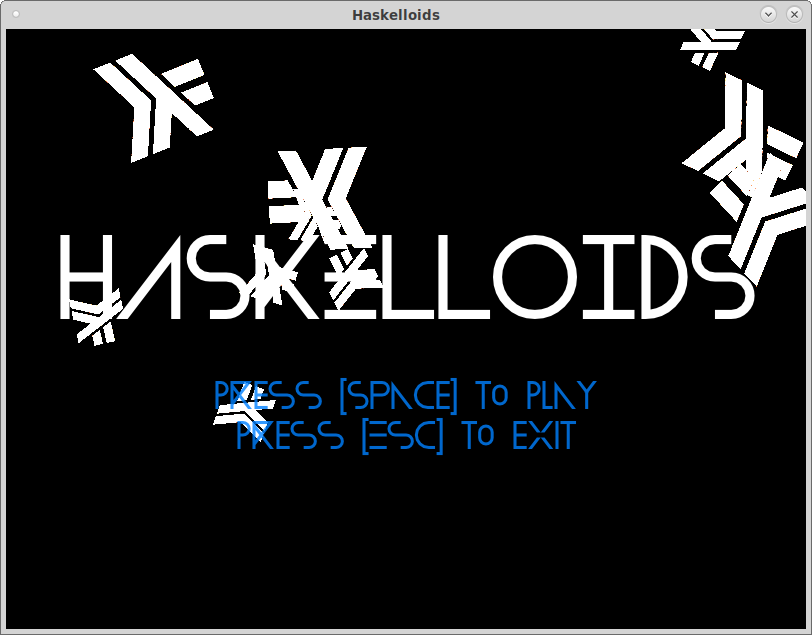

# haskelloids

A small game written in Haskell using my own game engine "Affection".

## Build instructions

I recommend highly to use cabal sandboxes for building this project.

### Dependencies

to build this you need a working Haskell build environment and following
development libraries:

* sdl2
* libglew

You will also need the engine package itself, which can be obtained at
[its own repo](https://github.com/nek0/affection). YOu cann add it to your
by invoking `cabal sandbox add-source <path>`.

To install all haskell package dependencies, invoke
`cabal install --only-dependencies`.

This will take quite some time. Be patient.

### Building

If all is well, you can invoke `cabal build` and watch everything come together.

## Running

To run the game, just execute the binary `dist/build/haskelloids/haskelloids` in
your build location.

### Controls

use `W`, `A`, `S` and `D` to move your ship, use `Space` to shoot.

use `O` to togle fullscreen mode.
